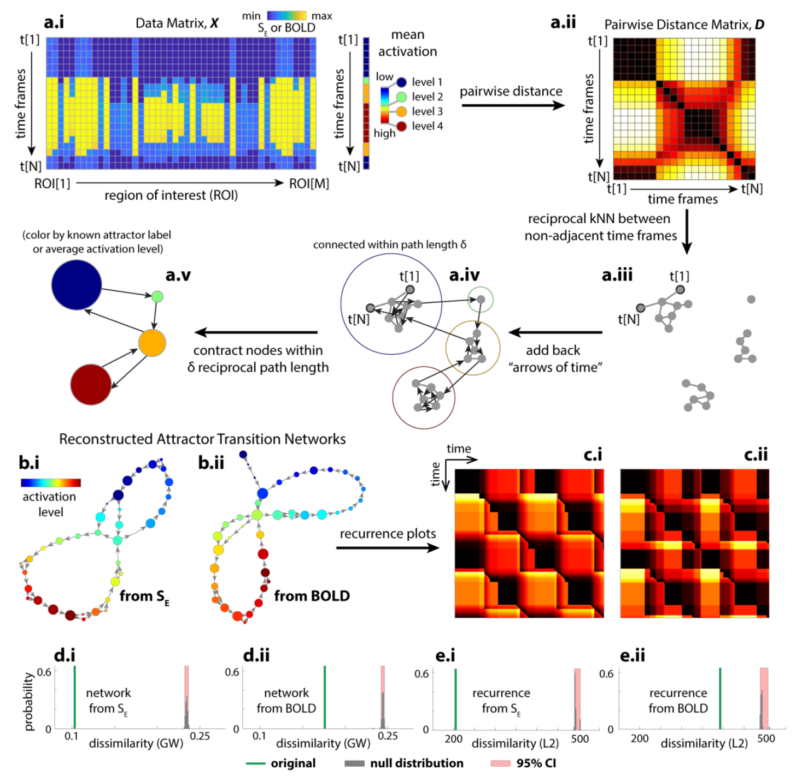
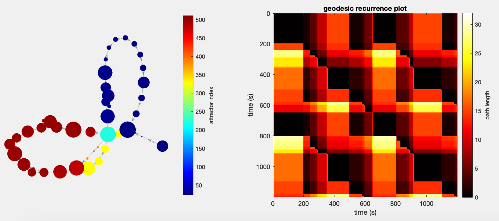

# Temporal Mapper

This repository hosts code related to the Temporal Mapper project written by Mengsen Zhang. The associated paper is the following:

> Zhang, M., Chowdhury, S., & Saggar, M. (2022). [Temporal Mapper: transition networks in simulated and real neural dynamics](https://braindynamicslab.github.io/papers/tmapper/). *Network Neuroscience*.

## Overview 

Here's a schematic (Fig. 3 from the paper) showing how Temporal Mapper operates on a dataset.

## Interface

To run the code, you only need a `(time_frames x nodes)` matrix! Try starting with the code provided in `run_sim.m`. You should get the following image:

When running with your own data, you only need to supply two parameters:
* **k**: locality parameter for kNN graph construction
* **delta**: distance parameter for performing asymmetric graph compression 

**Dependencies**

The core Temporal Mapper code has been tested on [Matlab R2020b](https://www.mathworks.com/products/new_products/release2020b.html). 

## Extras

To facilitate comparison of transition networks of different sizes, we also provide a GPU implementation of a variant of the Gromov-Wasserstein distance. Please see the readme inside the `GWTLBgpu` folder for more details.
